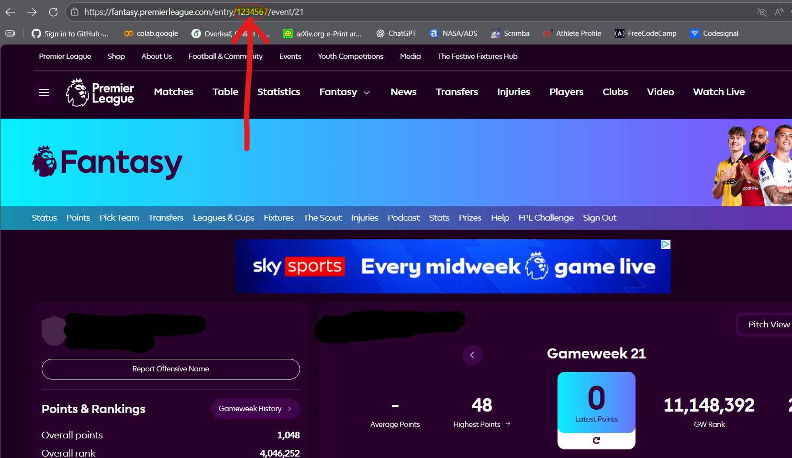

# Setup Instructions

To run locally run:
docker build -t fpl-api:latest .
docker run --rm -p 8000:8000 --env-file .env -e PORT=8000 fpl-api:latest

Also don't forget that the endpoints have /entry/
e.g. <http://localhost:8000/entry/3982786/insights>

Deployed on render.com: <https://fpl-api-aqej.onrender.com/entry/3982786/insights>

## How to get your Manager ID number

To get your manager id (the entry_id for this api to work) go to your own fpl team on the offical fpl website, and look at your current team selection. Then your entry_id or manager id is the number in the url, e.g. [https://www.fantasy.premierleague.com/entry/<ENTRY_ID>/event/21]

## How to get your League ID

To get your league id, just as for the manager ID go to that league's current standing/table page on the official fpl website, and the id is the numerical part of the url, e.g. [https://www.fantasy.premierleague.com/league/<LEAGUE_ID>/standings/c/]

